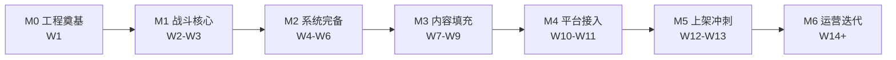

# 口袋守塔 · 轻量塔防（微信小游戏）

> 个人副业项目：Cocos Creator 3.x + TypeScript 开发的休闲塔防微信小游戏，同步导出 PC 网页版，纯广告变现。
> 当前状态：**MVP 战斗内核已完成并通过无头验证**（83% 通关率），Cocos 编辑器工程待初始化。

---

## 文档索引

| 文档 | 说明 | 读者 |
|---|---|---|
| **[docs/SDD.md](docs/SDD.md)** | **软件设计文档**：项目背景、技术栈与依赖、架构与模块划分（Mermaid）、数据模型与接口定义、业务流程、分阶段开发计划（里程碑 + 任务清单 + 优先级）、风险与验收标准 | 开发、评审 |
| [docs/游戏设计方案.md](docs/游戏设计方案.md) | **GDD 游戏设计方案**（v1.0）：核心玩法、塔防类型与地图规模、5 塔 × 3 级数值、技能系统、30 主线关 + 10 挑战关 + 无尽模式、怪物设计、数值公式、性能与美术规范 | 策划、开发、美术 |
| **[docs/数值校准报告.md](docs/数值校准报告.md)** | **数值校准报告**：GDD 原值实测 0% 通关 → 参数扫描 → 校准后 83% 通关 / 单局 261s；含完整偏差对照表与调参入口 | 策划、开发 |
| [docs/小游戏副业规划-轻量塔防第一作.md](docs/小游戏副业规划-轻量塔防第一作.md) | 副业规划：市场调研、变现模型与收益测算、上架合规清单（软著/备案/流量主）、竞品拆解 | 项目负责人 |
| [docs/开发里程碑.md](docs/开发里程碑.md) | 8 周周级任务清单（按 10~15 小时/周排布） | 开发 |
| [docs/UI设计稿更新清单.md](docs/UI设计稿更新清单.md) | 画布逐节点更新指令（对齐 GDD v1.0 数值），含 NodeId 与「原内容 → 新内容」 | UI、开发 |
| [.workbuddy/memory/MEMORY.md](.workbuddy/memory/MEMORY.md) | 项目长期备忘：已定的技术/业务决策与红线 | 全体 |

---

## 项目速览

| 项 | 内容 |
|---|---|
| 游戏名 | 《口袋守塔》 |
| 品类 | 休闲塔防（固定路线 + 有限塔位） |
| 技术栈 | Cocos Creator 3.x + TypeScript |
| 平台 | 微信小游戏（主）、PC 网页 H5（次） |
| 后端 | 微信云开发（云函数 + 云数据库） |
| 变现 | 激励视频（复活/双倍金币/技能重抽）+ 插屏，无内购 |
| 内容量 | 主线 30 关（5 章）+ 支线挑战关 10 关 + 无尽模式 |
| 单局时长 | 3~5 分钟（10 波 + 波间三选一） |
| 关键指标 | 主包 ≤4MB、60FPS、DrawCall ≤60、次留 ≥20% |

---

## 快速开始

```bash
npm install      # 安装 typescript / @types/node（仅开发期依赖）
npm start        # ⭐ 构建并启动 Web 原型 → http://localhost:5173/web/index.html
```

三种运行方式，按需要选用：

| 方式 | 命令 | 用途 | 是否需要 Cocos |
|---|---|---|---|
| **① Web 原型（推荐先跑这个）** | `npm start` | 浏览器里真实试玩：建塔、出怪、波次、三选一、结算 | ❌ 不需要 |
| ② 无头模拟 | `npm run sim` | 30 关自动战斗，输出通关率与单局时长（数值回归） | ❌ 不需要 |
| ③ 参数扫描 | `npm run tune` | 扫描移速 × 基础HP × 关卡系数，找平衡区间 | ❌ 不需要 |

其他命令：`npm run typecheck`（纯逻辑层类型检查）、`npm run build:web`（只构建不启动）、`npm run smoke:web`（用 DOM 桩在 Node 里冒烟测试整条运行链路）。

### Web 原型操作说明

| 操作 | 方式 |
|---|---|
| 建造 | 右侧先点选塔种 → 再点画布上的白色虚线塔位 |
| 升级 | 点击已建造的塔 |
| 拆除 | `Shift` + 点击塔（返还 60%） |
| 开始 / 下一波 | 「开始 / 下一波」按钮或空格键 |
| 波次间三选一 | 浮层里点选一条被动 |
| 切换关卡 / 倍速 / 暂停 | 右侧对应按钮（×1 / ×2 / ×3） |

### 在 Cocos Creator 中打开（后续正式开发）

场景、预制体与图集尚未创建，需先在编辑器里建工程再合入代码：

1. Cocos Dashboard → 新建空白 3.x 项目（选择 **empty** 模板，不含示例资源）
2. 关闭编辑器，把本仓库的 `assets/`、`tsconfig.json`、`package.json` 覆盖到新工程根目录
3. 重新打开工程，等待编译；在 `assets/scenes/` 下新建 `Home` / `Battle` 场景
4. 把 `assets/scripts/ui/` 下的组件挂到对应节点，并在属性检查器里绑定 Label / Node 引用
5. 微信小游戏导出：菜单栏「项目 → 构建发布」选择 **微信小游戏**，填入 AppID

> `assets/scripts/core` 与 `assets/scripts/battle` 不依赖引擎，可直接在编辑器中使用，也可在 Node 下无头运行。

`npm run sim` 当前结果：**通关率 83%（25/30，失败集中在终章第 26~30 关）、单局平均 261 秒、平均漏怪 5 只/关**。详见 [docs/数值校准报告.md](docs/数值校准报告.md)。

## 目录结构

```
wx-mobile-game/
├── README.md
├── docs/                        # 设计、方案与校准报告
├── assets/
│   ├── scripts/
│   │   ├── core/                # GameManager / EventCenter / ObjectPool / ConfigLoader / Rng / types
│   │   ├── battle/              # BattleRuntime / WaveController / TowerSystem / EnemyManager / SkillSystem / EconomyService
│   │   ├── ui/                  # BattleHUD / SkillChoosePanel / ResultPanel（Cocos 组件）
│   │   └── platform/            # AdService / SaveManager / CloudService
│   ├── resources/config/        # towers / enemies / levels / skills / waves / map（数值外置）
│   └── scenes/                  # Home / Battle（待 Cocos 编辑器创建）
├── tools/                       # simulate（全量验证）/ tune（参数扫描）/ AutoPlayer（共享策略）
├── tsconfig.json                # 编辑器侧（'cc' 类型由 Cocos 提供）
└── tsconfig.sim.json            # 纯逻辑侧（可在 Node 下编译运行）
```

**架构约定**：`core/` 与 `battle/` 不 import 任何 Cocos 模块，可在 Node 下无头运行，便于数值回归；`ui/` 与 `platform/` 通过事件总线订阅战斗事件，两层不互相持有引用。

> Cocos 场景、预制体与图集需在 Cocos Creator 编辑器中创建（本仓库只提交代码与配置）。

## 设计资产

- **UI 设计画布**：Ardot 文件 `719815448098951`（游戏大纲板 + 主页 / 关卡选择 / 战斗 / 三选一 / 复活面板 5 张界面）
- **设计稿截图**：`.workbuddy/screenshots/`（`board.png`、`home.png`、`levels.png`、`battle.png`、`skills.png`、`revive.png`）

---

## 当前阻塞项（按紧急度）

| 优先级 | 事项 | 说明 |
|---|---|---|
| **P0** | 提交**软著**申请 | 周期 1~3 个月，是唯一无法靠加人加速的前置项 |
| **P0** | 初始化 Git + Cocos 工程并锁定版本 | 详见 `docs/SDD.md` 第 0.2 节缺失清单 M1/M2/M5/M6 |
| **P0** | 注册小游戏账号，配置 `project.config.json` | 缺失清单 M4 |
| P1 | 微信云开发环境创建 | 缺失清单 M7 |
| P1 | 广告位 ID 申请（需先开通流量主） | 缺失清单 M9 |

---

## 开发路线（详见 SDD 第 6 章）



---

## 贡献与规范

- 文档统一使用**简体中文**，Markdown 格式，关键内容用表格呈现
- 数值一律外置到配置文件，**禁止在代码中硬编码数值**
- 不确定或待办项统一用 `TODO` 标注，不臆造实现细节
- 每次实质性变更后更新 `.workbuddy/memory/` 下的日志
