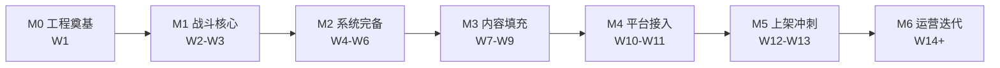

# 口袋守塔 · 轻量塔防（微信小游戏）

> 个人副业项目：Cocos Creator 3.x + TypeScript 开发的休闲塔防微信小游戏，同步导出 PC 网页版，纯广告变现。
> 当前状态：**设计定稿、工程未初始化**（零源码）。

---

## 文档索引

| 文档 | 说明 | 读者 |
|---|---|---|
| **[docs/SDD.md](docs/SDD.md)** | **软件设计文档**：项目背景、技术栈与依赖、架构与模块划分（Mermaid）、数据模型与接口定义、业务流程、分阶段开发计划（里程碑 + 任务清单 + 优先级）、风险与验收标准 | 开发、评审 |
| [docs/游戏设计方案.md](docs/游戏设计方案.md) | **GDD 游戏设计方案**（v1.0）：核心玩法、塔防类型与地图规模、5 塔 × 3 级数值、技能系统、30 主线关 + 10 挑战关 + 无尽模式、怪物设计、数值公式与平衡性验算、性能与美术规范 | 策划、开发、美术 |
| [docs/小游戏副业规划-轻量塔防第一作.md](docs/小游戏副业规划-轻量塔防第一作.md) | 副业规划：市场调研、变现模型与收益测算、上架合规清单（软著/备案/流量主）、竞品拆解、MVP 玩法与技术架构草案 | 项目负责人 |
| [docs/开发里程碑.md](docs/开发里程碑.md) | 8 周周级任务清单（按 10~15 小时/周排布） | 开发 |
| [docs/UI设计稿更新清单.md](docs/UI设计稿更新清单.md) | 画布逐节点更新指令（对齐 GDD v1.0 数值），含 NodeId 与「原内容 → 新内容」 | UI、开发 |
| [.workbuddy/memory/MEMORY.md](.workbuddy/memory/MEMORY.md) | 项目长期备忘：已定的技术/业务决策与红线 | 全体 |

---

## 项目速览

| 项 | 内容 |
|---|---|
| 游戏名 | 《口袋守塔》 |
| 品类 | 休闲塔防（固定路线 + 有限塔位） |
| 技术栈 | Cocos Creator 3.x + TypeScript |
| 平台 | 微信小游戏（主）、PC 网页 H5（次） |
| 后端 | 微信云开发（云函数 + 云数据库） |
| 变现 | 激励视频（复活/双倍金币/技能重抽）+ 插屏，无内购 |
| 内容量 | 主线 30 关（5 章）+ 支线挑战关 10 关 + 无尽模式 |
| 单局时长 | 3~5 分钟（10 波 + 波间三选一） |
| 关键指标 | 主包 ≤4MB、60FPS、DrawCall ≤60、次留 ≥20% |

---

## 目录结构（当前）

```
wx-mobile-game/
├── README.md                 # 本文件（文档索引）
├── docs/
│   ├── SDD.md                # 软件设计文档
│   ├── 游戏设计方案.md        # GDD
│   ├── 小游戏副业规划-轻量塔防第一作.md
│   ├── 开发里程碑.md
│   └── UI设计稿更新清单.md
└── .workbuddy/
    ├── memory/               # 项目记忆与工作日志
    └── screenshots/          # 设计稿校验截图
```

> 源码目录（`assets/`、`src/`）尚未创建，工程初始化后按 `docs/SDD.md` 第 2.3 节的目录规划建立。

---

## 设计资产

- **UI 设计画布**：Ardot 文件 `719815448098951`（游戏大纲板 + 主页 / 关卡选择 / 战斗 / 三选一 / 复活面板 5 张界面）
- **设计稿截图**：`.workbuddy/screenshots/`（`board.png`、`home.png`、`levels.png`、`battle.png`、`skills.png`、`revive.png`）

---

## 当前阻塞项（按紧急度）

| 优先级 | 事项 | 说明 |
|---|---|---|
| **P0** | 提交**软著**申请 | 周期 1~3 个月，是唯一无法靠加人加速的前置项 |
| **P0** | 初始化 Git + Cocos 工程并锁定版本 | 详见 `docs/SDD.md` 第 0.2 节缺失清单 M1/M2/M5/M6 |
| **P0** | 注册小游戏账号，配置 `project.config.json` | 缺失清单 M4 |
| P1 | 微信云开发环境创建 | 缺失清单 M7 |
| P1 | 广告位 ID 申请（需先开通流量主） | 缺失清单 M9 |

---

## 开发路线（详见 SDD 第 6 章）



---

## 贡献与规范

- 文档统一使用**简体中文**，Markdown 格式，关键内容用表格呈现
- 数值一律外置到配置文件，**禁止在代码中硬编码数值**
- 不确定或待办项统一用 `TODO` 标注，不臆造实现细节
- 每次实质性变更后更新 `.workbuddy/memory/` 下的日志
