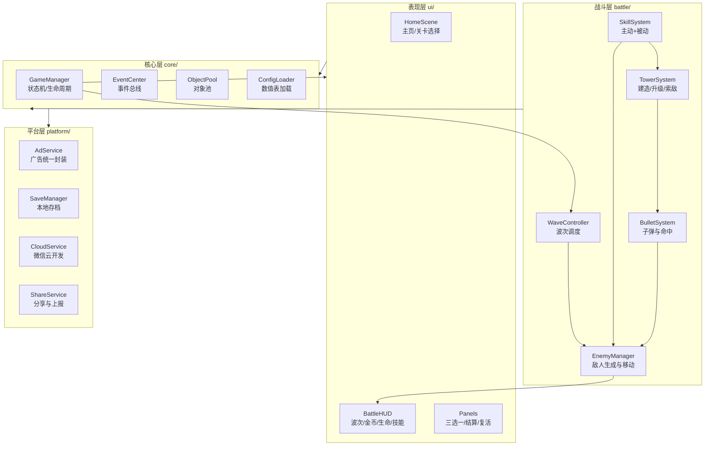
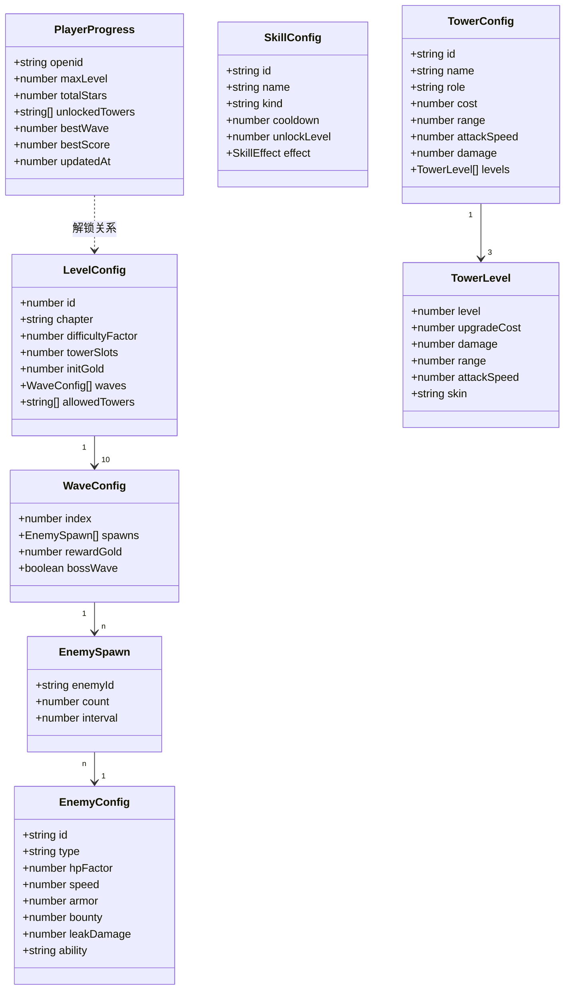
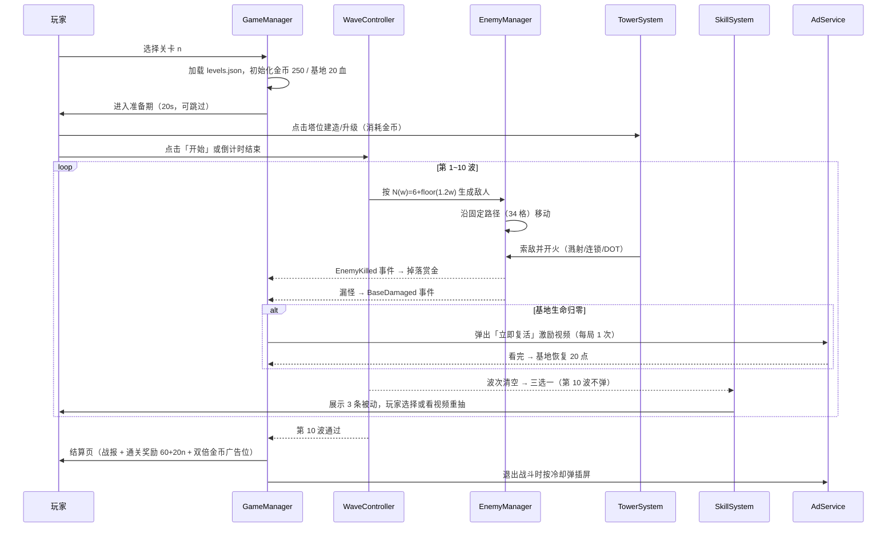
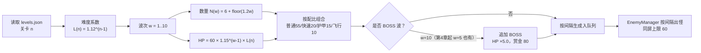
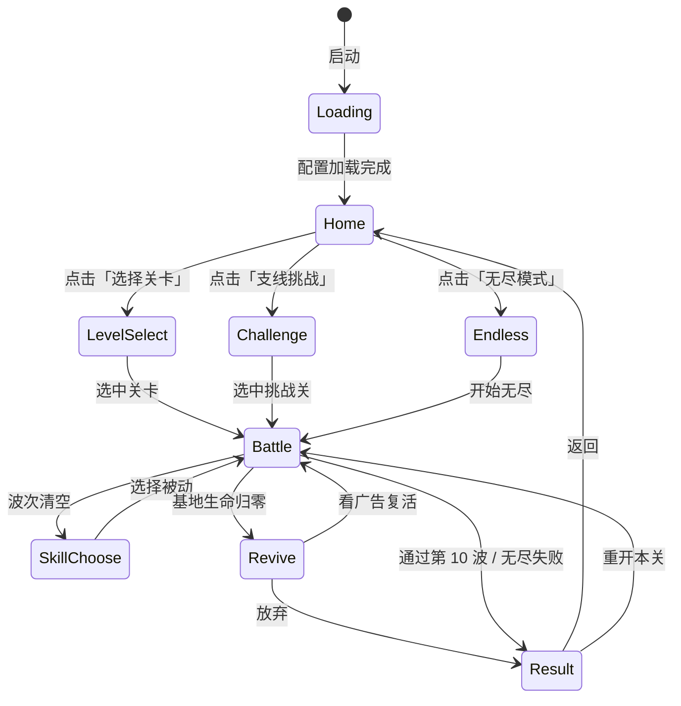
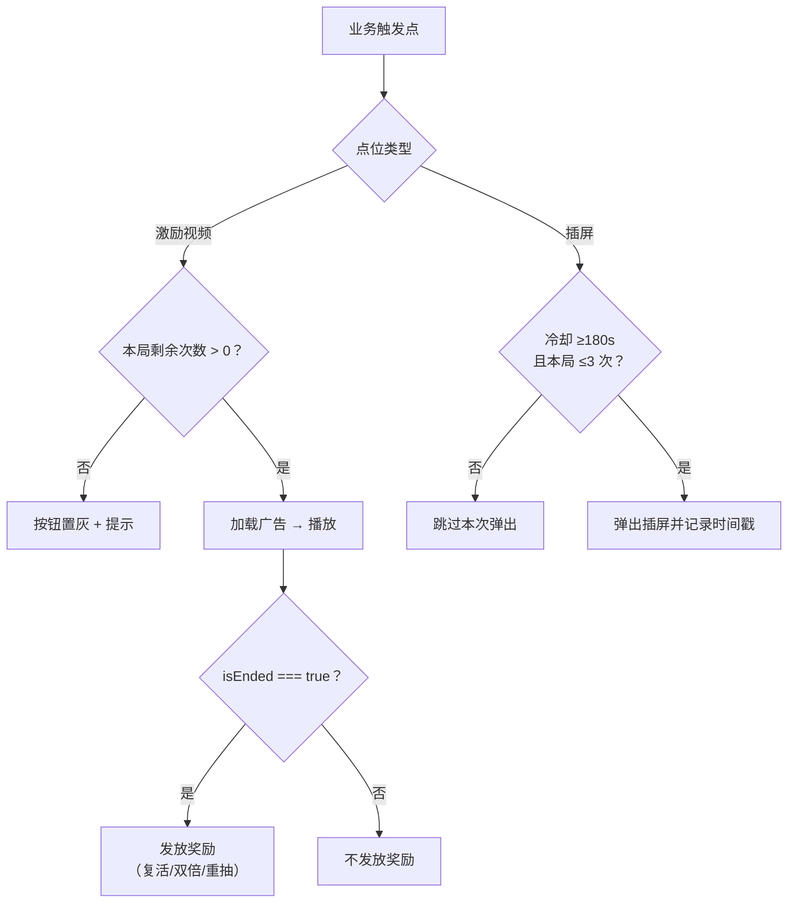
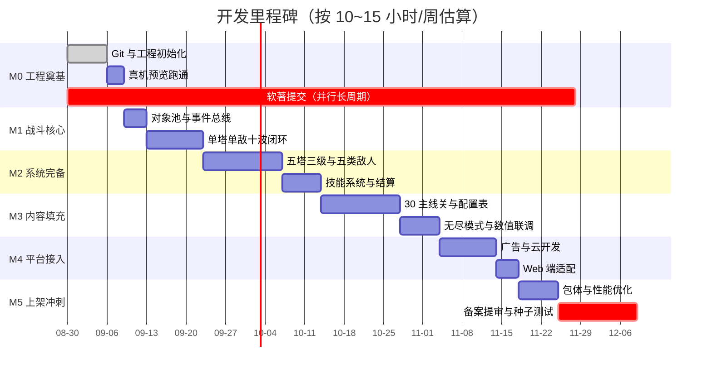

# 《口袋守塔》轻量塔防 · 软件设计文档（SDD）

> 版本：v1.0（初版，基于项目现状编写）｜日期：2026-08-29
> 扫描范围：`B:\workBuddy-space\wx-mobile-game` 项目根目录
> 编写原则：**只描述已存在的事实 + 已定稿的设计**；未实现部分一律标注 `TODO`，不臆造实现细节

---

## 目录

- [0. 扫描结论与缺失信息清单](#0-扫描结论与缺失信息清单)
- [1. 项目背景与目标](#1-项目背景与目标)
- [2. 技术栈及依赖说明](#2-技术栈及依赖说明)
- [3. 整体架构与模块划分](#3-整体架构与模块划分)
- [4. 核心数据模型与关键接口定义](#4-核心数据模型与关键接口定义)
- [5. 主要业务流程](#5-主要业务流程)
- [6. 分阶段开发计划](#6-分阶段开发计划)
- [7. 风险点与应对策略](#7-风险点与应对策略)
- [8. 验收标准](#8-验收标准)
- [9. 附录：文档索引与参考资料](#9-附录文档索引与参考资料)

---

## 0. 扫描结论与缺失信息清单

### 0.1 当前项目真实文件清单

执行探测后的根目录结构（`find` + 存在性校验结果）：

| 路径 | 类型 | 说明 |
|---|---|---|
| `docs/游戏设计方案.md` | 文档（543 行） | GDD v1.0，11 章，玩法/数值/关卡/怪物/性能预算 |
| `docs/小游戏副业规划-轻量塔防第一作.md` | 文档（172 行） | 市场调研、变现模型、合规清单、技术架构草案 |
| `docs/开发里程碑.md` | 文档（51 行） | 8 周周级任务清单 |
| `docs/UI设计稿更新清单.md` | 文档（166 行） | 画布逐节点更新指令（对齐 GDD 数值） |
| `.workbuddy/memory/MEMORY.md` | 项目记忆 | 项目定位与已定技术/业务决策 |
| `.workbuddy/memory/2026-08-28.md` | 工作日志 | 每日进展记录 |
| `.workbuddy/screenshots/*.png` | 截图（6 张） | 画布设计稿校验截图（board/home/levels/battle/skills/revive） |

### 0.2 缺失信息清单（必须先补齐才能进入实现）

| # | 缺失项 | 影响 | 建议补齐时机 | 状态 |
|---|---|---|---|---|
| M1 | **没有任何源码**：无 `assets/`、`src/`、Cocos 工程目录 | 无法分析真实代码结构，本 SDD 的模块与接口均为**设计态** | 开发第 1 周 `cocos new` 初始化后回填 | `TODO` |
| M2 | **无依赖清单**：缺 `package.json` / `project.json` / `tsconfig.json` | 依赖版本、构建命令无法确定 | 工程初始化时确定 | `TODO` |
| M3 | **无构建脚本**：缺构建、分包、上传配置 | 无法定义 CI 与产物校验 | 第 5 周（分包优化阶段） | `TODO` |
| M4 | **无 `project.config.json` / `game.json`** | 微信小游戏 AppID、编译选项、分包配置未知 | 注册小游戏账号后（第 1 周） | `TODO` |
| M5 | **无版本控制**：缺 `.git`、`.gitignore` | 无变更历史、无回滚能力 | **立即**（第 1 周第 1 天） | `TODO` |
| M6 | **Cocos Creator 具体版本号未定** | 影响 API 兼容与导出插件版本 | 选版后固定，建议锁定小版本 | `TODO` |
| M7 | **微信云开发环境 ID 未创建** | 排行榜与存档接口无法联调 | 第 5~6 周 | `TODO` |
| M8 | **软著尚未提交** | 上架阻塞项（周期 1~3 个月） | **第 1 周立即提交** | `TODO` |
| M9 | 广告位 ID（`adUnitId`）未申请 | 广告模块无法真机验证 | 第 5 周开通流量主后 | `TODO` |

> **结论**：本项目目前处于**「设计已定稿、工程未初始化」**阶段。因此本 SDD 的架构图、数据模型、接口定义均为**待实现的规范（Spec）**，不是对既有实现的描述；所有代码块均标注 `(设计态 · 尚未实现)`。

---

## 1. 项目背景与目标

### 1.1 背景

| 项 | 内容 |
|---|---|
| 项目定位 | 个人副业项目：微信小游戏（休闲塔防） |
| 开发人力 | 1 人（Java 工程师，有微信小程序经验，TS 为新增技能） |
| 投入强度 | 10~15 小时/周（工作日晚间 + 周末） |
| 商业模式 | 纯广告变现（激励视频 + 插屏），**无内购**，因此通常无需版号 |
| 市场依据 | 2026.8 微信小游戏畅销榜 Top100 中塔防品类 12 款在榜，《向僵尸开炮》居首 |

> 来源：`docs/小游戏副业规划-轻量塔防第一作.md` 第 1、2 章

### 1.2 目标与非目标

| 类型 | 内容 |
|---|---|
| **业务目标** | ① 跑通「开发 → 上架 → 起量」完整闭环；② 首作次留 ≥ 20% 以获得平台自然推流；③ 沉淀可复用的 Cocos 框架，支撑后续换皮矩阵 |
| **技术目标** | ① 微信小游戏主包 ≤ 4MB；② 60FPS / DrawCall ≤ 60；③ 一套代码双端（微信小游戏 + PC 网页） |
| **非目标** | 不做多英雄养成、不做 SLG/联网对战、不做内购与账号体系（微信身份即账号） |

### 1.3 已定稿的关键决策（GDD v1.0）

| 决策 | 结论 |
|---|---|
| 路径机制 | 固定路线 + 有限塔位（无寻路、无自建迷宫） |
| 地图规模 | 9 列 × 14 行 = 126 格；路径 34 格；塔位 14 个（逐章开放 8→14） |
| 塔系统 | 5 种塔 × 3 级（箭 80 / 冰 120 / 毒 140 / 炮 150 / 电 180） |
| 内容量 | 主线 30 关（5 章）+ 支线挑战关 10 关 + 无尽模式 |
| 单局时长 | 3~5 分钟（准备 20s + 10 波战斗 + 波间三选一 + 结算） |
| 后端 | 微信云开发（云函数 + 云数据库），用于排行榜与存档 |
| 变现 | 激励视频 3 点位（复活 / 双倍 / 重抽）+ 插屏（一局 ≤ 3 次） |

---

## 2. 技术栈及依赖说明

### 2.1 技术选型

| 层 | 选型 | 理由 | 状态 |
|---|---|---|---|
| 游戏引擎 | **Cocos Creator 3.x** | 微信小游戏一键导出成熟、TS 原生、社区资料最全 | 版本待定 `TODO(M6)` |
| 开发语言 | **TypeScript** | 与 Java 类型系统接近，迁移成本低 | 已定 |
| 主运行平台 | **微信小游戏**（Canvas / WebGL） | 目标平台 | 已定 |
| 次运行平台 | **PC 网页 H5** | 同引擎导出，仅切换布局与输入层 | 已定 |
| 后端 | **微信云开发**（云函数 + 云数据库） | 个人主体可用、零运维、免费额度足够 | 环境未建 `TODO(M7)` |
| 存档 | 微信云开发数据库 + 本地 `wx.setStorage` 双写 | 离线可玩，联网同步 | 已定 |
| 广告 | 微信流量主（激励视频 / 插屏 / 原生模板） | 唯一变现通道 | ID 未申请 `TODO(M9)` |
| 版本控制 | **Git** | 当前缺失，需立即初始化 `TODO(M5)` | 待建 |

### 2.2 依赖清单

> **当前无任何依赖清单文件**（`package.json` / `project.json` 均缺失，`TODO(M2)`）。以下为**预期依赖**，工程初始化后需回填并锁定版本：

| 依赖 | 用途 | 预期来源 | 版本 |
|---|---|---|---|
| Cocos Creator 编辑器内置引擎 | 渲染、UI、动画、资源管线 | 编辑器内置，无 npm 依赖 | `TODO(M6)` |
| `@types/wechat-minigame` | 微信小游戏 API 类型提示 | npm devDependencies | `TODO` |
| 微信开发者工具 | 预览、真机调试、上传 | 官方客户端安装 | `TODO` |
| 微信云开发 SDK | 数据库读写、云函数调用 | 小游戏基础库内置 | `TODO` |

> ⚠️ **原则**：休闲小游戏应尽量**零第三方运行时依赖**，所有工具函数（对象池、事件总线、数值表）自行实现，以控制包体与维护成本。

### 2.3 工程目录规划（设计态）

> 尚未创建（`TODO(M1)`）。以下为 GDD 与规划文档中已确认的目录约定：

```
assets/
├── scripts/
│   ├── core/        # GameManager, EventCenter, ObjectPool, SaveManager
│   ├── battle/      # EnemyManager, TowerSystem, BulletSystem, WaveController
│   ├── ui/          # HUD, SkillChoosePanel, ResultPanel, RevivePanel
│   └── platform/    # AdService, ShareService, Analytics, CloudService
├── resources/
│   ├── config/      # 数值配置（towers.json / enemies.json / levels.json / skills.json）
│   ├── prefabs/     # 塔、敌人、子弹、特效预制体
│   └── textures/    # 图集
└── scenes/          # Home.scene, Battle.scene
```

---

## 3. 整体架构与模块划分

### 3.1 分层架构图



### 3.2 模块职责说明

| 模块 | 目录 | 职责 | 依赖 |
|---|---|---|---|
| `GameManager` | `core/` | 全局单例；游戏状态机（Loading→Home→Battle→Result）；场景切换 | EventCenter、ConfigLoader |
| `EventCenter` | `core/` | 发布订阅；解耦战斗层与 UI 层（类比 Spring `ApplicationEvent`） | 无 |
| `ObjectPool` | `core/` | 敌人/子弹/特效/伤害数字的对象复用，杜绝运行时 `new` | 无 |
| `ConfigLoader` | `core/` | 加载 `resources/config/*.json`，提供类型安全的数值查询 | 无 |
| `WaveController` | `battle/` | 波次调度、生成节奏、波次结算、三选一触发 | EnemyManager、Economy、EventCenter |
| `EnemyManager` | `battle/` | 敌人生成、沿固定路径移动、受伤/死亡、漏怪判定 | ObjectPool、ConfigLoader |
| `TowerSystem` | `battle/` | 塔位管理、建造/升级/拆除、索敌与开火 | BulletSystem、ConfigLoader |
| `BulletSystem` | `battle/` | 子弹飞行、命中判定、溅射/连锁/DOT 结算 | ObjectPool |
| `SkillSystem` | `battle/` | 主动技能冷却与释放；被动三选一抽取与生效 | TowerSystem、EnemyManager |
| `EconomyService` | `battle/` | 金币产出与消耗、关内经济独立结算 | EventCenter |
| `AdService` | `platform/` | 三个广告位的统一封装；**onClose 只注册一次** | 微信 API |
| `CloudService` | `platform/` | 排行榜读写、存档同步、防作弊上报 | 微信云开发 |
| `SaveManager` | `platform/` | 本地进度缓存（`wx.setStorageSync`） | 微信 API |

### 3.3 关键设计约定

| 约定 | 内容 |
|---|---|
| 逻辑与渲染分离 | 数值计算不依赖节点树遍历，战斗逻辑可在无渲染下跑通（便于自动化测试） |
| 对象池强制 | 敌人上限 60、子弹上限 120，超出延迟生成而非创建新节点 |
| 事件驱动 UI | 战斗层只发事件（`EnemyKilled`、`WaveCleared`、`BaseDamaged`），UI 层订阅 |
| 配置驱动 | 所有数值外置到 `resources/config/`，禁止硬编码，便于调参与 A/B |
| 广告合规内建 | `AdService` 内部实现冷却与次数限制，业务层无法绕过 |

---

## 4. 核心数据模型与关键接口定义

> ⚠️ 以下类型与接口均为**设计态规范**，当前代码库中不存在对应实现（`TODO(M1)`）。工程初始化后需按此实现并回填路径。

### 4.1 数据模型关系图



### 4.2 核心类型定义（设计态）

```typescript
// 文件规划路径：assets/scripts/core/types.ts —— (设计态 · 尚未实现)
// 数值来源：docs/游戏设计方案.md 第 3、6、7 章

export enum EnemyType {
  Normal = 'normal',   // 普通
  Fast    = 'fast',    // 快速：无视 30% 减速
  Armor   = 'armor',   // 护甲：固定减伤 10
  Flying  = 'flying',  // 飞行：直线飞向基地
  Boss    = 'boss',    // BOSS：每 10s 回复 2% 最大生命
}

export interface EnemyConfig {
  id: string;
  type: EnemyType;
  hpFactor: number;     // 1.0 / 0.6 / 1.8 / 0.9 / 5.0
  speed: number;        // 格/秒：1.1 / 1.9 / 0.8 / 1.4 / 0.7
  armor: number;        // 固定减伤
  bounty: number;       // 赏金：8 / 6 / 14 / 12 / 80
  leakDamage: number;   // 漏怪扣血：1 / 1 / 2 / 1 / 5
  ability?: string;
}

export interface TowerLevel {
  level: 1 | 2 | 3;
  upgradeCost: number;  // Lv1→2 = 基础×0.8，Lv2→3 = 基础×1.4
  damage: number;       // 每级 ×1.6
  range: number;        // 每级 +0.3 格
  attackSpeed: number;  // Lv3 额外 +10%
  skin: string;         // 外观资源名
}

export interface TowerConfig {
  id: string;
  name: string;         // 箭塔 / 炮塔 / 冰塔 / 电塔 / 毒塔
  role: string;
  cost: number;         // 80 / 150 / 120 / 180 / 140
  levels: TowerLevel[]; // 固定 3 级
}

export interface PlayerProgress {
  openid: string;
  maxLevel: number;        // 主线进度 1~30
  totalStars: number;
  unlockedTowers: string[];
  bestWave: number;        // 无尽模式
  bestScore: number;
  updatedAt: number;
}
```

### 4.3 关键接口定义（设计态）

```typescript
// 文件规划路径：assets/scripts/battle/WaveController.ts —— (设计态 · 尚未实现)
// 公式来源：docs/游戏设计方案.md 第 7.1 节
export interface IWaveController {
  /** 开始下一波：n=关卡序号，w=波次，用于 HP = 60 × 1.15^(w-1) × 1.12^(n-1) */
  startWave(levelId: number, waveIndex: number): void;
  /** 提前召唤下一波（奖励金币） */
  callNextWaveEarly(): void;
  /** 当前波是否清空 */
  isWaveCleared(): boolean;
  /** 波次清回调：触发三选一与结算奖励 15 + 5×w */
  onWaveCleared(cb: (wave: number, reward: number) => void): void;
}
```

```typescript
// 文件规划路径：assets/scripts/platform/AdService.ts —— (设计态 · 尚未实现)
// 合规约束来源：docs/游戏设计方案.md 第 9 章
export interface IAdService {
  /** 激励视频：复活 → 每局 1 次；双倍 → 每关 1 次；重抽 → 每局 3 次 */
  showRewarded(placement: 'revive' | 'doubleGold' | 'reroll'): Promise<boolean>;
  /** 插屏：冷却 ≥3 分钟，单局 ≤3 次 */
  showInterstitial(): void;
  /** 查询某点位本局剩余次数（业务层用于置灰按钮） */
  remaining(placement: string): number;
}
```

```typescript
// 文件规划路径：assets/scripts/platform/CloudService.ts —— (设计态 · 尚未实现)
// 字段来源：docs/游戏设计方案.md 第 5.3 节排行榜字段表
export interface ICloudService {
  /** 上报无尽模式成绩，云函数侧做防作弊校验 */
  submitEndlessScore(record: {
    bestWave: number; bestScore: number; totalKills: number;
    towerComp: string; durationSec: number; reviveUsed: number;
  }): Promise<void>;
  /** 拉取榜单：world（Top100）/ friend（好友榜） */
  fetchRanking(scope: 'world' | 'friend'): Promise<LeaderboardRecord[]>;
  /** 存档同步：本地与云端时间戳比对后取新 */
  syncProgress(progress: PlayerProgress): Promise<PlayerProgress>;
}
```

### 4.4 配置项清单（规划）

| 配置文件 | 内容 | 来源章节 | 状态 |
|---|---|---|---|
| `assets/resources/config/towers.json` | 5 塔 × 3 级数值 | GDD 第 3.3 节 | `TODO` |
| `assets/resources/config/enemies.json` | 5 类怪物属性 | GDD 第 6.1 节 | `TODO` |
| `assets/resources/config/levels.json` | 30 主线关 + 10 挑战关 | GDD 第 5.1、5.2 节 | `TODO` |
| `assets/resources/config/skills.json` | 3 主动 + 12 被动 | GDD 第 4.1、4.2 节 | `TODO` |
| `assets/resources/config/waves.json` | 波次生成参数 | GDD 第 7.1 节 | `TODO` |

---

## 5. 主要业务流程

### 5.1 单局战斗主流程



### 5.2 波次生成与难度计算流程



### 5.3 游戏状态机



### 5.4 广告触发与合规控制流程



---

## 6. 分阶段开发计划

> 依据：`docs/开发里程碑.md` 的 8 周计划，结合 GDD v1.0 的内容量（5 塔 / 30 关 / 无尽 / 云开发）进行扩展与优先级标注。
> 投入假设：**10~15 小时/周**。

### 6.1 里程碑总览

| 阶段 | 周次 | 目标 | 交付物 | 优先级 |
|---|---|---|---|---|
| **M0 工程奠基** | W1 | 工程可编译、可真机预览、版本可回滚 | Git 仓库、Cocos 工程、空场景真机跑通 | **P0** |
| **M1 战斗核心** | W2-W3 | 单局可玩闭环（1 塔 1 敌 10 波） | 战斗场景 + 波次 + 经济 | **P0** |
| **M2 系统完备** | W4-W6 | 5 塔 3 级、5 类敌人、技能系统 | 完整塔/敌/技能实现 | **P0** |
| **M3 内容填充** | W7-W9 | 30 主线关 + 10 挑战关 + 无尽 | 配置表 + 关卡数据 | **P1** |
| **M4 平台接入** | W10-W11 | 广告、云开发、排行榜、双端适配 | AdService/CloudService/Web 版 | **P0** |
| **M5 上架冲刺** | W12-W13 | 性能达标、合规过审、发布 | 提审通过、正式上线 | **P0** |
| **M6 运营迭代** | W14+ | 数据复盘与调优 | 迭代版本 | **P2** |

### 6.2 任务清单（可执行、带优先级）

#### M0 · 工程奠基（W1）

| # | 任务 | 产出 | 优先级 | 依赖 |
|---|---|---|---|---|
| T1.1 | 初始化 Git 仓库 + `.gitignore`（忽略 `library/`、`temp/`、`build/`） | 版本控制 | P0 | 无 |
| T1.2 | 确定并锁定 Cocos Creator 版本，创建工程 | 可编译工程 | P0 | T1.1 |
| T1.3 | 建立 `core/battle/ui/platform` 四层目录骨架 | 目录结构 | P0 | T1.2 |
| T1.4 | 跑通「空场景 → 微信开发者工具 → 真机预览」 | 构建链路验证 | P0 | T1.2 |
| T1.5 | 注册小游戏账号、配置 `project.config.json` | AppID 可用 | P0 | 无 |
| T1.6 | **提交软著申请**（源码模板可用示例工程） | 受理号 | P0 | T1.2 |
| T1.7 | 搭建 `ConfigLoader` + 首份 `towers.json` | 配置驱动能力 | P1 | T1.3 |

#### M1 · 战斗核心（W2-W3）

| # | 任务 | 产出 | 优先级 | 依赖 |
|---|---|---|---|---|
| T2.1 | 实现 `ObjectPool`（敌人/子弹/特效） | 对象池模块 | P0 | T1.3 |
| T2.2 | 实现 `EventCenter`（发布订阅） | 事件总线 | P0 | T1.3 |
| T2.3 | 固定路径数据 + 敌人沿路移动（34 格） | 移动系统 | P0 | T2.1 |
| T2.4 | 实现 `TowerSystem`：建造、索敌、开火（先只做箭塔） | 单塔战斗 | P0 | T2.3 |
| T2.5 | 实现 `WaveController`：10 波生成 + 波次结算 | 波次系统 | P0 | T2.3 |
| T2.6 | 实现 `EconomyService`：击杀掉金、建造扣费 | 经济闭环 | P0 | T2.5 |
| T2.7 | 基地生命 20 点 + 漏怪扣血 + 失败判定 | 胜负条件 | P0 | T2.5 |
| T2.8 | 战斗 HUD（波次/金币/生命/倍速/暂停） | 可玩界面 | P0 | T2.6 |

#### M2 · 系统完备（W4-W6）

| # | 任务 | 产出 | 优先级 | 依赖 |
|---|---|---|---|---|
| T3.1 | 补齐 5 塔：冰塔减速、炮塔溅射、电塔连锁穿透、毒塔 DOT | 塔系统完整 | P0 | T2.4 |
| T3.2 | 塔 3 级升级 + 外观切换（Lv2 副武器 / Lv3 旗帜） | 升级系统 | P0 | T3.1 |
| T3.3 | 5 类敌人：护甲减伤、飞行直线、BOSS 回复 | 敌人系统 | P0 | T2.3 |
| T3.4 | 被动三选一系统（12 条池 + 叠加上限 5 层） | Roguelike 层 | P0 | T2.5 |
| T3.5 | 主动技能 3 个（冷却/解锁/释放） | 技能系统 | P1 | T3.4 |
| T3.6 | 结算页 + 复活面板 UI | 结算流程 | P0 | T2.7 |
| T3.7 | `SaveManager` 本地存档 + 关卡解锁 | 进度持久化 | P0 | T2.8 |

#### M3 · 内容填充（W7-W9）

| # | 任务 | 产出 | 优先级 | 依赖 |
|---|---|---|---|---|
| T4.1 | 30 主线关配置（5 章，塔位 8→14，难度 1.12^(n-1)） | `levels.json` | P1 | T3.x |
| T4.2 | 10 支线挑战关（限定条件 + 特殊目标校验） | 挑战关数据 | P2 | T4.1 |
| T4.3 | 无尽模式（波次生成 + 每 5 波 BOSS + 移速递增） | 无尽玩法 | P1 | T3.3 |
| T4.4 | 关卡选择 UI（章节 Tab + 关卡格状态） | 选关界面 | P1 | T4.1 |
| T4.5 | 数值联调：跑 GDD 第 7.3 节三处验算 | 平衡报告 | P0 | T4.1 |

#### M4 · 平台接入（W10-W11）

| # | 任务 | 产出 | 优先级 | 依赖 |
|---|---|---|---|---|
| T5.1 | `AdService`：激励视频 3 点位 + 插屏冷却/次数控制 | 广告模块 | P0 | T3.6 |
| T5.2 | 开通流量主（走游戏圈条件，体验版即可） | 广告位 ID | P0 | T1.5 |
| T5.3 | 微信云开发环境 + 云函数（排行榜 + 防作弊校验） | 后端能力 | P0 | 无 |
| T5.4 | `CloudService`：成绩上报 + 榜单拉取 + 存档同步 | 联网能力 | P1 | T5.3 |
| T5.5 | PC 网页版导出与布局/输入适配（1280×720） | Web 版本 | P1 | T2.8 |
| T5.6 | 真机广告联调（重点验证 `onClose` 只注册一次） | 广告可用性 | P0 | T5.1 |

#### M5 · 上架冲刺（W12-W13）

| # | 任务 | 产出 | 优先级 | 依赖 |
|---|---|---|---|---|
| T6.1 | 包体优化：主包 ≤4MB、分包、纹理压缩（ASTC/ETC2） | 达标包体 | P0 | T4.1 |
| T6.2 | 性能达标：DrawCall ≤60、同屏 ≤60 敌、60FPS | 性能报告 | P0 | T6.1 |
| T6.3 | 美术统一为低多边形卡通（面数与配色规范） | 美术终稿 | P1 | 无 |
| T6.4 | 游戏备案 + 提交审核（软著须已下发） | 过审 | P0 | T1.6 |
| T6.5 | 种子用户测试 20~50 人，观察次留 | 数据报告 | P0 | T6.4 |

#### M6 · 运营迭代（W14+）

| # | 任务 | 优先级 |
|---|---|---|
| T7.1 按数据复盘调 `L(n)` 底数与塔效率 | P0 |
| T7.2 广告点位与文案 A/B（提升观看率） | P1 |
| T7.3 沉淀框架，启动第二作（换皮矩阵） | P2 |

### 6.3 依赖关系图



---

## 7. 风险点与应对策略

| # | 风险 | 等级 | 表现 | 应对策略 |
|---|---|---|---|---|
| R1 | **软著周期 1~3 个月**阻塞上架 | 高 | 开发完成但无法提审 | 第 1 周立即提交（源码模板即可）；必要时走加急代理 |
| R2 | 次留 < 20%，平台不推流 | 高 | 无自然量，收益为零 | 前期不急着接广告，先把留存做上去；种子用户阶段快速调难度曲线 |
| R3 | TS/Cocos 学习曲线影响进度 | 中 | 任务延期 | Java→TS 仅语法迁移；优先复用官方模板与示例，避免自造轮子 |
| R4 | 包体超 4MB | 中 | 无法上传或首屏慢 | 按章节分包、纹理压缩、远程 CDN；从 W1 就设定资源预算 |
| R5 | 广告违规被封禁 | 高 | 流量主权限关闭 | `AdService` 内建冷却与次数限制；严格遵守「不强制/不诱导/一局插屏 ≤3 次」 |
| R6 | 数值失衡（过难或过简单） | 中 | 卡关流失或无聊 | 数值全部外置配置；按 GDD 第 7.3 节三处验算校准，预留 `L(n)` 全局旋钮 |
| R7 | 云开发配额或冷启动延迟 | 低 | 榜单加载慢 | 本地缓存榜单，异步刷新；控制读写频次（每日结算一次） |
| R8 | 单人开发时间不可控 | 中 | 里程碑顺延 | 严格按 P0/P1/P2 分级，P2（挑战关、皮肤）可延后至上线后迭代 |
| R9 | 微信政策/备案规则变化 | 中 | 上架受阻 | 关注官方公告；预留 2 周缓冲；无内购路线规避版号风险 |

---

## 8. 验收标准

### 8.1 功能验收（P0，必须全部满足）

| # | 验收项 | 判定标准 |
|---|---|---|
| A1 | 单局闭环 | 可从选关进入 → 建塔 → 10 波战斗 → 波间三选一 → 结算，全程无崩溃 |
| A2 | 五塔三级 | 箭/冰/毒/炮/电 5 种塔可建造、可升至 3 级；造价与数值与 `towers.json` 一致（80/120/140/150/180） |
| A3 | 五类敌人 | 普通/快速/护甲/飞行/BOSS 行为符合 GDD 第 6 章（含护甲减伤、飞行直线、BOSS 回复） |
| A4 | 数值公式 | `HP = 60 × 1.15^(w-1) × 1.12^(n-1)`、`N(w) = 6 + floor(1.2w)` 实跑一致 |
| A5 | 三选一 | 每波清空弹出 3 条被动，第 10 波不弹；同类叠加上限 5 层生效 |
| A6 | 基地与失败 | 基地 20 点生命；漏怪按 1/1/2/1/5 扣血；归零弹复活面板 |
| A7 | 广告点位 | 复活/双倍/重抽三个激励点位可用；插屏冷却 ≥180s 且单局 ≤3 次 |
| A8 | 存档 | 关卡进度本地可持久化；冷启动后正确恢复 |

### 8.2 性能验收（P0）

| # | 指标 | 标准 | 测试方式 |
|---|---|---|---|
| B1 | 主包体积 | ≤ 4MB | 微信开发者工具「代码包大小」 |
| B2 | 总包体积 | ≤ 20MB | 同上（含分包） |
| B3 | 帧率 | 平均 ≥55FPS，1% 低帧 ≥30FPS | 真机 Profile（iPhone 8 / 千元安卓） |
| B4 | DrawCall | ≤ 60 | Cocos Profiler |
| B5 | 同屏敌人 | ≤ 60（超出延迟生成） | 无尽模式第 30 波压测 |
| B6 | 内存 | iOS ≤200MB / Android ≤250MB | 真机内存监控，连续 3 局无增长（无泄漏） |
| B7 | 首屏加载 | ≤ 3s（4G） | 真机计时 |

### 8.3 合规与上架验收（P0）

| # | 验收项 | 标准 |
|---|---|---|
| C1 | 软著 | 已下发（提审前置） |
| C2 | 备案 | 已完成 |
| C3 | 流量主 | 已开通，广告可正常拉取 |
| C4 | 广告合规 | 无强制、无诱导、按钮不重叠、单局插屏 ≤3 次 |
| C5 | 隐私与权限 | 不索取不必要的用户授权；云开发仅存 openid/昵称/头像/成绩 |

### 8.4 质量验收（P1）

| # | 验收项 | 标准 |
|---|---|---|
| D1 | 配置驱动 | 修改 `towers.json` 数值后无需改代码即可生效 |
| D2 | 无硬编码数值 | 战斗代码中不存在魔法数字（Code Review 检查） |
| D3 | 对象池 | 战斗全程无 `instantiate` 峰值（Profiler 节点数平稳） |
| D4 | 双端一致 | PC 网页版与移动端玩法、数值完全一致，仅布局与输入不同 |
| D5 | 日志记录 | 关键事件（关卡开始/结束、广告触发、异常）有日志，便于线上排查 |

### 8.5 运营验收（P2，上线后 4 周内）

| # | 指标 | 目标 |
|---|---|---|
| E1 | 次日留存 | ≥ 20%（平台推流门槛） |
| E2 | 7 日留存 | ≥ 8% |
| E3 | 人均激励视频观看 | ≥ 3 次/日 |
| E4 | 单局时长 | 落在 3~5 分钟区间 |
| E5 | 关卡流失点 | 无单关流失率突增 > 30% 的异常点 |

---

## 9. 附录：文档索引与参考资料

### 9.1 项目内文档

| 文档 | 路径 | 作用 | 与本文关系 |
|---|---|---|---|
| 游戏设计方案（GDD） | `docs/游戏设计方案.md` | 玩法、塔、技能、关卡、怪物、数值、性能预算 | **本 SDD 的需求与数值来源** |
| 副业规划与开发方案 | `docs/小游戏副业规划-轻量塔防第一作.md` | 市场调研、变现模型、合规清单、技术架构草案 | 背景与商业约束来源 |
| 开发里程碑 | `docs/开发里程碑.md` | 8 周周级任务 | 与本 SDD 第 6 章互补，本文为扩展版 |
| UI 设计稿更新清单 | `docs/UI设计稿更新清单.md` | 画布逐节点更新指令 | UI 实现依据 |
| 项目长期备忘 | `.workbuddy/memory/MEMORY.md` | 已定的技术/业务决策 | 决策一致性校验 |
| 工作日志 | `.workbuddy/memory/2026-08-28.md` | 每日进展 | 变更历史 |

### 9.2 设计资产

| 资产 | 位置 | 说明 |
|---|---|---|
| UI 设计画布 | Ardot 文件 `719815448098951` | 大纲板 + 5 张手机界面（主页/关卡选择/战斗/三选一/复活） |
| 设计稿截图 | `.workbuddy/screenshots/` | `board.png`、`home.png`、`levels.png`、`battle.png`、`skills.png`、`revive.png` |

### 9.3 外部参考（待补充 `TODO`）

| 项 | 说明 |
|---|---|
| Cocos Creator 官方文档 | 版本确定后补充精确链接与 API 参考 |
| 微信小游戏官方文档 | 广告、云开发、分包、备案相关章节链接待补 |
| 微信小游戏运营规范 | 广告合规细则，需在开发前通读 |

---

## 10. 结论

本项目当前处于**「设计定稿、工程零代码」**状态。GDD（`docs/游戏设计方案.md`）已提供完整且自洽的玩法与数值定义，UI 设计稿已产出并待对齐更新，本 SDD 在此基础上补齐了**架构分层、数据模型、接口契约、开发计划、风险与验收标准**。

**立即要做的三件事**（均在 W1）：

1. 初始化 Git 与 Cocos 工程，锁版本（解除 `TODO(M1)(M2)(M5)(M6)`）
2. **提交软著申请** —— 最长前置项，直接决定能否按期上架
3. 注册小游戏账号并配置 `project.config.json`（解除 `TODO(M4)`）

完成 M0 后，请回填本文件第 0.2 节缺失清单的状态，并将第 4 章的设计态接口替换为真实文件路径下的实现。
